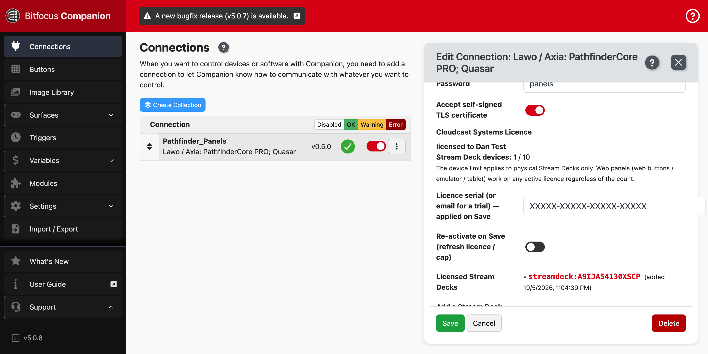

# PathfinderCore PRO Panels & Quasar Consoles — Companion Manual

Operator manual for the **Cloudcast Systems** Bitfocus Companion module that
drives **Lawo / Axia PathfinderCore PRO** user panels and **Lawo Quasar**
console faders from any Companion surface — Stream Deck, Stream Deck Studio,
Stream Deck+, X-keys, Loupedeck, web buttons, the emulator or a tablet.

### 📖 [Read the manual →](https://cloudcastsystemsau.github.io/pathfinder-companion-manual/)

The manual is a single self-contained page (all screenshots embedded). You can
also open [`index.html`](index.html) directly, or download it for offline use.

---

## What's inside

1. **Requirements** — Companion 5.0+, the .NET 8 runtime, a licence serial
2. **Install the module** — importing the `.tgz` package
3. **Add the connection** — finding and adding *Lawo / Axia: PathfinderCore PRO; Quasar*
4. **Configure the panel** — the panel URL and login
5. **Licensing** — activating a serial or trial, and the *Re-activate on Save* control
6. **Stream Deck devices** — the device limit, and adding/removing physical decks manually
7. **Using it** — presets, actions, feedbacks and variables
8. **Connection health** — surfacing an offline Pathfinder server
9. **Troubleshooting**

---

## Get the module

The module package and installation notes are distributed from the Cloudcast
Systems downloads site. Licence serials are supplied with purchase.

- Support & issues: <https://github.com/cloudcastsystemsau/pathfinder-deck/issues>

© Cloudcast Systems. Module v0.5.0.
